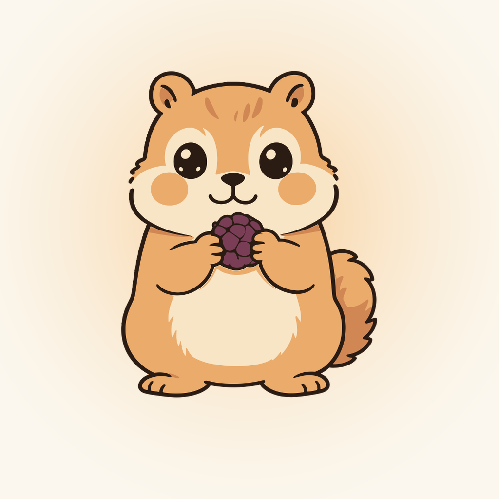

<div align="center">



# 松鼠轻断食 · Autophagy168

**一只会随你断食进度变化的松鼠，陪你走完每一个 16:8。**

iOS · SwiftUI · SwiftData · WidgetKit · Live Activity · App Intents · iOS 18+

</div>

---

## 这是什么

**松鼠轻断食**是一个极简的间歇性断食（Intermittent Fasting）追踪 app。核心不是又一张冷冰冰的倒计时——而是一只**会代谢的松鼠吉祥物**：它随着你真实的断食进度，从「进食」一路演到「自噬」，用姿势、呼吸、光环和粒子把身体里正在发生的事画出来。

循环**锚定在你点下的那一刻**，而不是固定钟点。点一下开始断食，点一下开始进食，节律从这一刻接上——不用设定「12:00–20:00」这种死板窗口。

一切数据都在本地（SwiftData + App Group），**无账号、无网络、无追踪**。

## 特性

- 🐿️ **会代谢的松鼠**：5 个代谢阶段随真实进度演进，配进度环 + 每阶段专属粒子特效
- 🎨 **两套松鼠皮肤**：经典 / 矢量，设置里一键切换，带缩略图预览
- ⏱️ **一键切换断食/进食**：循环锚定你的点击，不绑死钟点；未达标提前切换会二次确认
- 📊 **节律可选**：16:8 / 18:6 / 20:4
- 📈 **统计面板**：当前/最长连续天数、周完成率、30 天柱状图、5 周热力图
- 🔒 **锁屏 & 灵动岛 Live Activity**：实时倒计时 + 进度，随阶段更新
- 🎛️ **控制中心 & Siri**：一键切换断食状态，无需打开 app（App Intents / Action Button / Spotlight）
- 🔔 **贴心提醒**：断食达成、进食窗口将关（提前 1h）、进食窗口结束——均为 time-sensitive 本地通知
- 🧩 **桌面小组件**：四种尺寸（圆形/矩形/内联/小号）

## 松鼠的五个代谢阶段

松鼠不是随机换姿势——每个阶段对应一段断食进度里身体的真实代谢状态（**科普性示意，非医学测量**）：

| 阶段 | 时机（断食进度） | 身体在做什么 | 视觉 |
|---|---|---|---|
| 🌰 进食 `feeding` | 进食窗口 | 摄入能量 | 咀嚼式轻快呼吸 |
| 😌 饱足 `satiated` | 0–12% | 血糖上升 | 满足的深呼吸 |
| 🍠 消化 `digesting` | 12–50% | 用糖供能 | 困倦摇摆 |
| 🌙 自噬 `autophagy` | 50–90% | 深度燃脂、自噬启动 | 蜷睡 + 白色治愈粒子 ✨ |
| 🌅 苏醒 `waking` | 90–100% | 重启循环 | 伸懒腰 + 金色星星 |

进度环的弧线会扫向当前阶段的节点，文案随阶段切换。

## 两套皮肤 · 经典 vs 矢量

设置面板里可切换松鼠画风，偏好持久化保存：

- **经典**：app 原生的松鼠画风，阶段间做 0.6s 透明度交叉淡入。
- **矢量**：一套独立的矢量松鼠，换姿势时叠加一段 **squash & stretch 挤压回弹**（0.42s，横向 +16% / 纵向 −24% 再过冲回弹）——用形变运动盖住换姿势那一下，读起来像「蹲下弹起」。

两套都是 PDF 矢量资产（Preserve Vector Data），任意放大不糊。Live Activity 与桌面组件用系统 SF Symbol（`moon.zzz.fill` / `flame.fill` / `fork.knife`），保证锁屏与灵动岛上一眼可辨。

## 架构

纯 SwiftUI，零第三方依赖。三层源码在两个 target 间共享：

```
App/       主 app target —— SwiftUI 视图 + ViewModel
├─ Autophagy168App.swift   @main 入口；SwiftData 容器；调试启动参数
├─ ContentView.swift        主屏（切换按钮、设置/统计 sheet）
├─ MascotView.swift         松鼠编排：进度 → 阶段 → 姿势/环/粒子
├─ SquirrelPoseView.swift   单个姿势 + 呼吸动画（脚部锚点对齐）
├─ LoopStage.swift          5 阶段枚举（资产/配色/锚点/呼吸曲线）
├─ AutophagyRing.swift      进度环 UI
├─ LoopStageFX.swift        每阶段程序化粒子（Canvas）
├─ StatsView.swift          统计面板
└─ FastingViewModel.swift   @Observable @MainActor 实时状态

Shared/    app 与组件共享
├─ FastingEngine.swift      纯状态机：now + Schedule → 阶段 + 窗口
├─ FastSession.swift        SwiftData 模型（断食会话）
├─ Schedule.swift           节律（UserDefaults）
├─ MascotStyle.swift        皮肤枚举（持久化）
├─ SharedStore.swift        App Group 容器 + 快照
├─ StatsEngine.swift        统计推导
├─ Fast{Intents,Notifier}   App Intents / 本地通知
└─ Live{ActivityController,LockScreenView}  Live Activity

Widgets/   WidgetKit 扩展 —— 桌面组件 / Live Activity / 控制中心
```

**数据流**：`FastSession`（SwiftData）是唯一真相；ViewModel 在 tick/toggle 时刷新，并写一份 `StatusSnapshot` 到 App Group 的 UserDefaults，让组件与 Live Activity 无需触碰 SwiftData 即可渲染。进食窗口**锚定上一次断食的结束时间**，而非固定钟点（这是核心回归测试点）。

**技术栈**：SwiftUI · SwiftData · WidgetKit · ActivityKit · App Intents · UserNotifications · `@Observable` / `@MainActor`（Swift 5.9+）。

## 构建与运行

> 需要 Xcode 26+、iOS 18.0+ 目标、[XcodeGen](https://github.com/yonaskolb/XcodeGen)。

本项目用 **XcodeGen** 管理工程——`project.yml` 是唯一真相，`.xcodeproj` 由它生成：

```bash
brew install xcodegen        # 若未安装
xcodegen generate            # 由 project.yml 生成 .xcodeproj
open Autophagy168.xcodeproj  # Xcode 里选真机/模拟器运行
```

命令行构建到已连接的真机：

```bash
xcodegen generate
xcodebuild build -scheme Autophagy168 \
  -destination 'id=<你的设备 UDID>' -configuration Debug
```

改动 target/entitlements/bundle id 请改 `project.yml` 后重跑 `xcodegen generate`，别直接编辑 `.xcodeproj`。

**开发脚手架**：DEBUG 构建启动时跑 `SelfCheck`——校验断食状态机、节律持久化、会话完成、通知排程、进食窗口锚定、统计计算等核心逻辑（app 能起来即全部通过）。另有调试启动参数用于直达各种 UI 状态：`-seedHistory` `-seedActiveFast` `-seedDigest` `-seedAutophagy` `-seedEating` `-widgetGallery` `-statsView` `-settingsView`。

## 隐私

- 全部数据本地存储（SwiftData，App Group 容器）。
- **无网络请求、无账号、无第三方 SDK、无分析追踪。**
- 通知与 Live Activity 均为设备本地能力。

## 目录一览

| 目录 | 用途 |
|---|---|
| `App/` | 主 app target（SwiftUI 视图、ViewModel） |
| `Shared/` | app 与组件共享的领域逻辑、模型、Live Activity、Intents |
| `Widgets/` | WidgetKit 扩展 |
| `Tools/` | 图标生成脚本 |
| `design_refs/` | 设计参考、图标候选留档 |
| `mascot/` | 松鼠素材生成提示词 |
| `project.yml` | XcodeGen 工程定义（唯一真相） |

## 授权

个人项目，暂未附开源许可证（默认保留所有权利）。如需以某种开源协议发布，欢迎提 issue。

---

<div align="center">
<sub>Made with 🐿️ · 一只陪你饿肚子的松鼠</sub>
</div>
