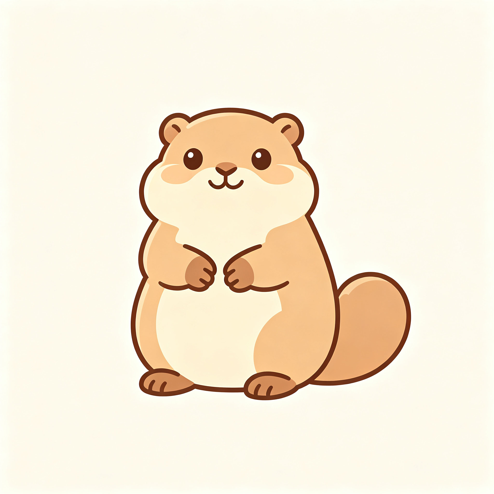
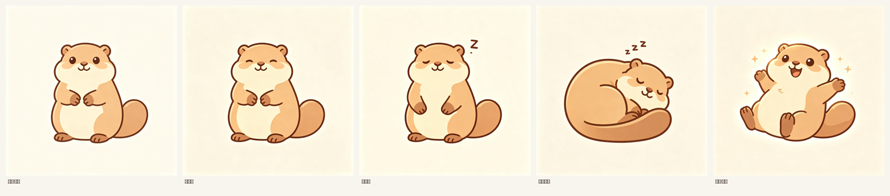
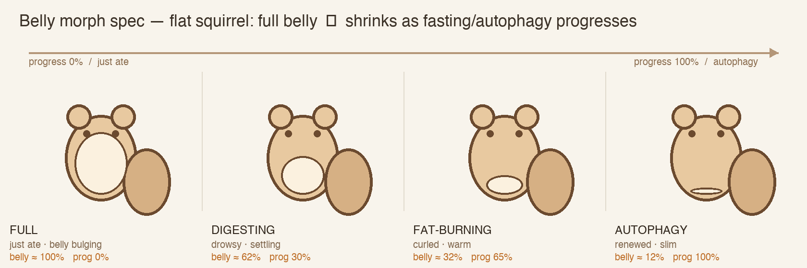

# Autophagy168 · 角色设计笔记（北极地松鼠吉祥物）

> 本笔记 = **flat-kawaii 扁平方向**的角色「圣经」。像素风旧方向见 [`../mascot/PROMPTS.md`](../mascot/PROMPTS.md)（2026-06-29）；两者关系见 §5。

## 0. 一句话定位

一只正面坐姿、Q 版扁平风的**北极地松鼠**，做「16:8 断食 / 自噬陪伴」App 的状态吉祥物——随断食进度变化（肚子鼓→瘪），把抽象代谢阶段变成看得见的小动物状态。

**生物学锚点**：北极地松鼠是**极端冬眠动物**（贴膘→蛰眠 torpor→唤醒 arousal），天然对应 进食→断食→自噬。这是它比普通树松鼠更贴题的根，务必守住。

## 1. 角色固定特征（跨所有状态不变）



- 敦实圆胖球形身体，头略小于身体（头身 ≈ 1:1.4），正面坐姿。
- 圆头 + 独立浅色**面罩**（吻部 + 两颊），对比头顶深色毛。
- 大圆黑眼分得开 + 高光；小三角鼻；嘴角上扬微笑；鼓腮帮；淡粉腮红。
- **小圆耳、位置低、贴头侧**——不是树松鼠的竖尖耳（辨识关键）。
- 配色：沙褐/暖棕主色（**不橘**），胸腹奶白。
- 粗深棕描边，扁平 kawaii，少量柔影，无写实、无复杂渐变，暖米色背景。
- **大尾巴**：粗大蓬松扫帚状，从身体**右侧**扬起，尖微内卷，体量近半个身子。构图＝身体偏左、右侧留给尾巴。

⚠️ **两个待拍板的分叉**（当前 refs 与最初 brief 有出入，二选一别混）：
- **斑点**：brief 要「全身奶白麻点」当签名特征；当前 `ref_character` 把斑点全去了。结论见 §3 → **只在背/头/尾加点，肚子保持干净**。
- **主色冷暖**：brief 要偏冷灰褐；当前 refs 偏暖沙褐。选暖就全暖。

## 2. 5 个代谢状态 × 肚子形变（核心）





**肚子大小 = 断食进度的可视量。进度 0→100% 时肚子 100%→12%。这是全 App 唯一随时间强变化的维度**，其余表情/动作叠在它之上。

| 状态 (en / 中) | App 含义 | 肚子% | 进度% | 关键姿态 / 特效 | 背景 | 剪影 |
|---|---|---|---|---|---|---|
| **awake** 清醒/警觉 | 进食窗待机·锚 | baseline | — | 直立、爪在胸前、亮眼 | 浅奶 | `sil_awake` 直立 |
| **fed** 贴膘 (FULL) | 刚进食 | ~100% | 0% | 坐、肚子鼓胀、塞腮、捧浆果、满足 | 暖桃 | — |
| **digesting** 消化 | 断食初 | ~62% | ~30% | 半眯眼、一爪搭肚、尾开始卷 | 暖琥珀 | — |
| **torpor** 深度蛰眠 (FAT-BURNING) | 断食中·燃脂 | ~32% | ~65% | 蜷成球、大尾整圈裹身、霜晶、露一耳一鼻 | 冷蓝 | `sil_curled` 蜷睡 |
| **arousal** 唤醒/**自噬** (AUTOPHAGY) | 16h 达成·自噬峰 | ~12% | 100% | 舒展打哈欠、睁眼、星点 + 微光环、焕新 | 紫金 | `sil_spark` 带火花 |

（肚子%/进度% 取自 `ref_belly_morph_spec`，即 SVG 形变关键帧表。）

## 3. SVG 生产决策（本轮讨论沉淀）

目标：让上面的状态/形变在 App 里**真能动，且好做**。

1. **光栅 ≠ SVG，双资产**：gpt-image-2 出的精图＝图标/营销/参考；会动的那只＝另搭**简化 SVG**。别逼 SVG 复刻精图每个细节。
2. **肚子 = 独立可形变形状**：肚子单独一个 `<ellipse>`/path，挂一个 `bellyProgress`（0–1）钩子，按 §2 关键帧把肚子 100%→12% 缩。**一个形状驱动整条进度轴**。
3. **斑点离开肚子**：若加斑点，只放在**不变形的刚体组**（头顶/上背/肩/尾巴），**肚子保持纯奶白、零点**。肚子是形变最大处，留干净＝最难的耦合直接消失；且真实地松鼠本就背上有斑、肚子素白，更准。
4. **斑点实现**二选一：① **静态分区**（推荐，刚体组上手放）；② `<pattern>` + `patternContentUnits="objectBoundingBox"`（想让斑点随形状缩放就用它，代价偏规则，用不规则多点瓦片压一下）。
5. **命名钩子清单**（每部件独立 `<g id>`）：`belly`(形变) · `eyes`(眨/眯/闭) · `mouth` · `blush` · `cheeks`(塞腮) · `ears` · `arms` · `tail`(摆/裹) · `fx-sparkle`(自噬) · `fx-frost`(蛰眠) · `fx-zzz`(睡)。

## 4. gpt-image-2 提示词 + 踩坑

固定角色块见 §1；完整像素风 prompt 见 [`../mascot/PROMPTS.md`](../mascot/PROMPTS.md)。下面是**扁平风 5 状态表** prompt（已带本轮修正，对齐 `ref_states`）：

```
A character expression sticker sheet of ONE mascot — a chubby Arctic ground
squirrel — as a clean 1x5 row of five square panels on a warm beige sheet, read
LEFT TO RIGHT as the metabolic cycle of a fasting day. Flat kawaii style, bold
dark-brown ink outline, minimal soft shading, no gradients, no realism.

Character is IDENTICAL in every panel — round head, pale face-mask (muzzle + two
cheeks), big wide-set black eyes with highlights, tiny triangular nose, small
low-set round ears tucked to the head (not pointed), warm sandy-tan fur (not
orange), cream-white belly, a big fluffy broom tail; cream-white speckles ONLY on
the head-top, upper back, shoulders and tail, with the chest and belly clean and
spot-free — EXCEPT for the ONE thing that must change panel to panel: BELLY / BODY
SIZE. Do not draw them the same size.

Panel 1 — AWAKE: standing upright on hind legs, paws at chest, head up, bright
alert eyes, pale-cream background.
Panel 2 — FED (full belly): sitting, belly bulging round and over-stuffed, cheeks
puffed, holding a small berry in both paws, content happy eyes, warm peach background.
Panel 3 — DIGESTING: sitting, drowsy half-closed eyes, one paw on a still-round but
settling belly, tail beginning to curl, warm amber background.
Panel 4 — TORPOR: curled in a tight ball, the big bushy tail wrapped fully around
the body like a blanket, one round ear and the nose tip poking out, tiny frost
crystals on the fur, cold blue background.
Panel 5 — AROUSAL / AUTOPHAGY: uncurling and stretching with a little yawn, eyes
opening, slim light body and flat empty belly, sparkle motes and a faint glowing
halo, violet-and-gold background, renewed and energized.

Avoid: realistic fur, orange/ginger color, tall pointy ears, thin/small tail,
speckles on the belly, drawing all bodies the same size, any text, extra animals.
```

**踩坑**：
- ❌ 写 `identical proportions in all panels` → 模型把肚子也锁死，六格一样胖。✅ 必须显式声明「**唯一允许且必须变化的是肚子/体型**」，其余一致。
- ❌ `slim/瘪` 是弱指令，kawaii 先天爱画胖 → 瘪格再加 `noticeably smaller and less puffy`，或瘪版单独抽。
- ✅ 斑点 rig-friendly 写法：`speckles ONLY on head-top/upper back/shoulders/tail; keep chest and belly clean and spot-free, like a real ground squirrel`。

## 5. 资产现状 / 待办

- **当前扁平方向 refs**：`ref_character.png` · `ref_states.png` · `ref_belly_morph_spec.png`（本目录，2026-06-30）。
- **旧像素风 v1**：`../mascot/*_v1*.png` + `CONTACT_SHEET.png` + `PROMPTS.md`（2026-06-29）。
- **管线脚本**：`../mascot/silhouette.py`(抠剪影) · `montage.py`(拼表) · `glyph_icon.py` · `../Tools/make_icon.py`。
- **待拍板**：① 斑点 留/去（§1、§3）；② 主色 冷/暖（§1）；③ **像素风 vs 扁平风——取代还是并存？**（两套 prompt 圣经不该无声共存，挑一个当 canon）。
- **下一步**：定稿 §1 角色 → 出 5 状态扁平表 → 抠剪影(28/44px) → 手搭 SVG（§3 钩子）。
